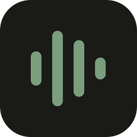
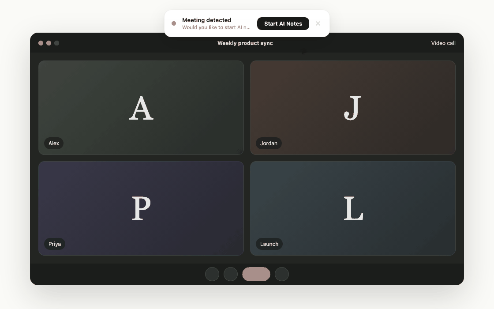
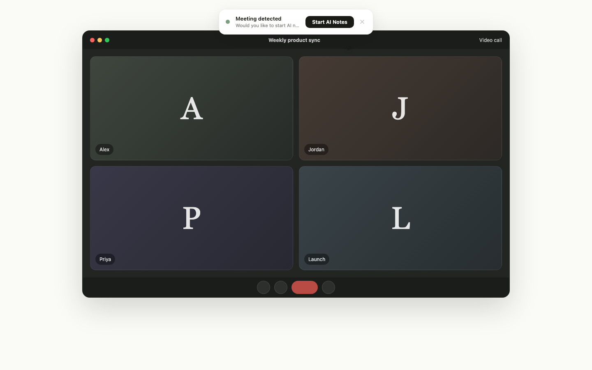
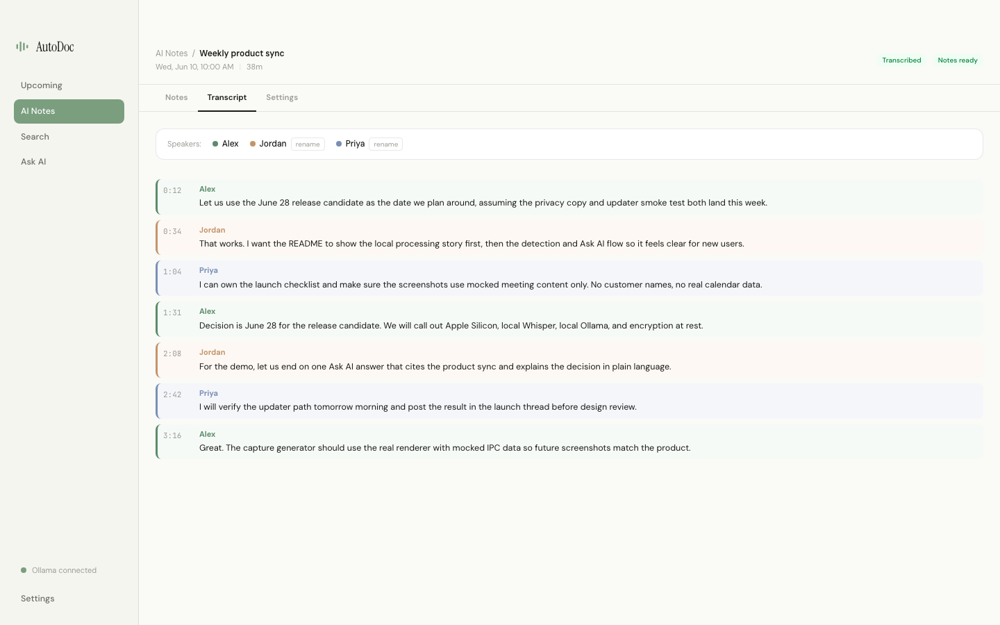
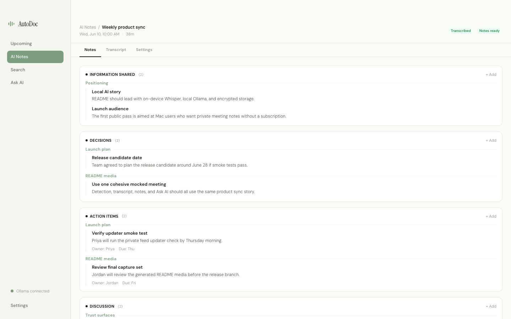
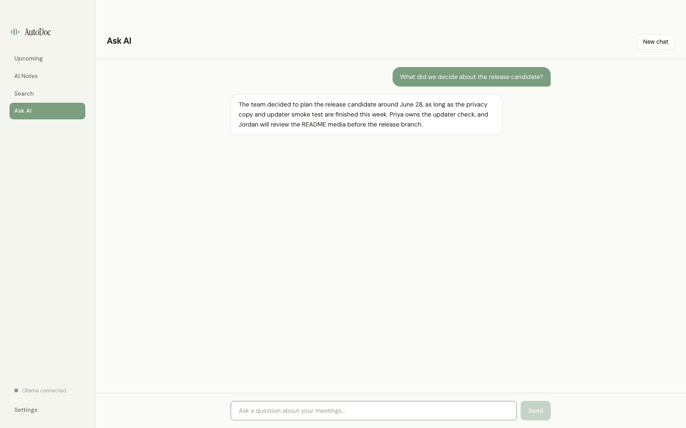

<div align="center">



# AutoDoc

### AI meeting notes that never leave your Mac.

Record, transcribe, and summarize your meetings entirely on-device — speaker diarization, calendar auto-record, and chat-with-your-meetings included. No cloud, no subscription, no data leaving your machine.

[](LICENSE)
[](#install)
[](PRIVACY.md)
[](https://github.com/DuetDisplay/AutoDoc-Local/releases/latest)
[](https://github.com/DuetDisplay/AutoDoc-Local/actions)

[**Website**](https://getautodoc.com/) · [Download](#install) · [Privacy](PRIVACY.md) · [How it works](PRODUCT.md) · [Self-hosting](docs/SELF_HOSTING.md)

</div>

---

<!--
  HERO DEMO PLACEHOLDER — highest-leverage element of this README.
  Drop the demo recording at docs/assets/demo.gif (or .mp4) and uncomment below.
  See docs/assets/CAPTURE_CHECKLIST.md for exactly what to capture.
-->
<div align="center">

<!--  -->
<em>📹 Demo video coming soon — see <a href="docs/assets/CAPTURE_CHECKLIST.md">capture checklist</a>.</em>

</div>

---

## Table of Contents

- [Why AutoDoc](#why-autodoc)
- [How AutoDoc compares](#how-autodoc-compares)
- [Features](#features)
- [Features in action](#features-in-action)
- [Install](#install)
  - [System requirements (macOS)](#system-requirements-macos)
- [Build from source](#build-from-source)
- [Architecture](#architecture)
- [Privacy](#privacy)
- [Roadmap](#roadmap)
- [FAQ](#faq)
- [Contributing](#contributing)
- [License](#license)
- [Acknowledgements](#acknowledgements)

## Why AutoDoc

Meeting AI tools are everywhere — but most of them ship your conversations to someone else's servers. AutoDoc takes the opposite stance: **every recording, transcript, and summary stays on your Mac.**

- **Truly local.** Transcription runs on-device with Apple [MLX](https://github.com/ml-explore/mlx) Whisper on Apple Silicon. Summaries run on a local [Ollama](https://ollama.com) instance AutoDoc manages for you. No API keys, no inference bills, no network round-trips for your audio.
- **Everything included.** Speaker diarization, Google **and** Microsoft calendar integration, automatic meeting detection, per-event auto-record, and chat-with-your-meetings are all part of the app — not a paid upgrade.
- **Encrypted at rest.** Recordings and transcripts are encrypted with AES-256-GCM, keyed through the macOS Keychain.
- **Mac-native.** Lives in your menu bar, detects meetings as they start, and gets out of your way.

## How AutoDoc compares

AutoDoc is built around a simple idea: the privacy-protecting choice shouldn't also be the feature-poor or expensive one.

| | **AutoDoc** | Cloud meeting AI | Other local/open-source assistants |
|---|:---:|:---:|:---:|
| Processing location | On your Mac | Vendor servers | On-device |
| Audio & transcripts leave your device | **Never** | Yes | Never |
| Speaker diarization | ✅ Included | Varies | Often paid / coming soon |
| Calendar + per-event auto-record | ✅ Google + Microsoft | ✅ | Often paid / coming soon |
| Automatic meeting detection | ✅ Included | Varies | Often paid |
| Chat with your meetings | ✅ Included | Often paid | Often paid / coming soon |
| Encryption at rest | ✅ AES-256-GCM | Vendor-controlled | Rarely |
| Paid tier required for the above | ❌ None | Usually | Sometimes |
| Cost | **Free & open source** | Subscription | Varies |

## Features

- **🎙️ Multi-track capture** — records screen, your microphone, and system audio as separate streams for clean diarization.
- **📝 On-device transcription** — MLX Whisper with `distil-large-v3` on Apple Silicon.
- **🗣️ Speaker identification** — two-stream diarization labels who said what, with calendar-aware name suggestions.
- **🧠 AI meeting notes** — structured Decisions, Action Items, Information, Discussion, and Status Updates extracted locally with Ollama.
- **💬 Ask AI** — ask questions across your meetings and get grounded answers, entirely on-device.
- **📅 Calendar integration** — Google and Microsoft calendars, with Off / Once / Series auto-record per event.
- **🔔 Automatic meeting detection** — notices when a meeting starts (Zoom, Meet, Teams, Webex, Slack) and offers to record.
- **🔎 Full-text search** — search every transcript and note, with deep links straight to the moment.
- **🔒 Encryption at rest** — AES-256-GCM for all recordings and transcripts, keyed via macOS Keychain.

See [`PRODUCT.md`](PRODUCT.md) for a deep technical breakdown of every subsystem.

## Features in action

<!--
  SCREENSHOT PLACEHOLDERS — add images to docs/assets/screenshots/ and uncomment.
  See docs/assets/CAPTURE_CHECKLIST.md for the recommended shot list.
-->

| Automatic meeting detection | Speaker-colored transcript |
|---|---|
| <!--  --> _screenshot coming soon_ | <!--  --> _screenshot coming soon_ |

| AI notes by category | Ask AI across meetings |
|---|---|
| <!--  --> _screenshot coming soon_ | <!--  --> _screenshot coming soon_ |

## Install

> **Platform support:** AutoDoc requires **macOS 14+ on Apple Silicon (M1 or later)**. Intel Macs are **not supported**. **Windows is on the roadmap.**

### System requirements (macOS)

Local-first meeting apps need real hardware headroom for on-device transcription and summarization. [Meetily](https://github.com/Zackriya-Solutions/meetily) publishes similar guidance in their [install docs](https://meetily.ai/blog/how-to-install-meetily) (OS version, RAM, storage). AutoDoc's numbers below reflect our bundled models and full feature set — not a copy of theirs, but the same class of requirements you should expect from any Whisper + Ollama desktop app.

| | Requirement |
|---|---|
| **macOS** | 14.0 (Sonoma) or later |
| **Chip** | **Apple Silicon required** (M1, M2, M3, M4, or later). Intel Macs are not supported. |
| **Memory** | **8 GB minimum** · **16 GB recommended** for the default concurrent processing profile |
| **Storage** | **~10 GB free** for first-run downloads (Whisper + local Ollama model + MLX runtime cache), plus additional space for your encrypted recordings |
| **Network** | Required once during onboarding to download local AI models; not needed for day-to-day recording after setup |
| **Permissions** | **Screen Recording**, **Microphone**, and **System Audio Capture** (for remote participant audio) |

**What to expect on an 8 GB Mac:** AutoDoc detects limited memory and switches to a lower-impact profile automatically — smaller notes model (`llama3.2:3b`), serialized audio processing, and longer transcription/notes times. Everything still runs locally; a 16 GB machine is simply more comfortable for hour-long meetings with concurrent processing.

Transcription is built on [MLX](https://github.com/ml-explore/mlx) and requires Apple Silicon — there is no Intel or Rosetta fallback.

### Download & install

1. Download the latest signed `AutoDoc-<version>.dmg` from the [**Releases**](https://github.com/DuetDisplay/AutoDoc-Local/releases/latest) page.
2. Open the `.dmg` and drag **AutoDoc** to your Applications folder.
3. Launch AutoDoc. On first run, it will guide you through granting **Screen Recording** and **Microphone** permissions and will set up its local transcription and AI models.

The build is code-signed and notarized by Apple. On first launch, models (Whisper + Ollama) are downloaded on-device — this is a one-time setup that uses the storage headroom above.

## Build from source

AutoDoc is an Electron + electron-vite app. To build it yourself:

**Prerequisites**

- **Apple Silicon Mac** (M1 or later) running macOS 14+
- Xcode command-line tools
- Node.js 20+
- [Homebrew](https://brew.sh) (used for `ffmpeg` tooling)

**Steps**

```bash
git clone https://github.com/DuetDisplay/AutoDoc-Local.git
cd AutoDoc-Local
npm ci
cp .env.example .env   # optional: configure self-hosting knobs
npm run build:mac      # produces a DMG under dist/
```

To run in development:

```bash
npm run dev
```

If you want calendar integration or your own hosted services in a fork build, see [`docs/SELF_HOSTING.md`](docs/SELF_HOSTING.md) for the required environment variables and OAuth setup. Forks do **not** use Duet's hosted infrastructure by default.

## Architecture

AutoDoc is a single Electron desktop app. The **main process** owns recording, the transcription/diarization/summarization pipeline, encryption, calendar sync, and the local Ollama lifecycle. The **renderer** is a React UI. All heavy processing happens locally.

```
┌─────────────────────────────────────────────────────────┐
│  AutoDoc (Electron, on your Mac)                          │
│                                                           │
│  Renderer (React UI)  ◄──IPC──►  Main process            │
│                                   │                        │
│   ┌───────────────────────────────┼──────────────────┐   │
│   │ Recording   Transcription   Diarization   Notes   │   │
│   │ (screen/    (MLX Whisper)   (two-stream)   (Ollama)│   │
│   │  mic/sys)                                           │   │
│   └───────────────────────────────┬──────────────────┘   │
│                                    ▼                        │
│              AES-256-GCM encrypted store                    │
│         (~/Library/Application Support/AutoDoc)             │
└───────────────────────────┬───────────────────────────────┘
                            │ (optional, OAuth token exchange only)
                            ▼
              Calendar auth worker (Google / Microsoft)
```

The only optional network component is a stateless Cloudflare Worker used purely for OAuth token exchange during calendar sign-in — it never sees your audio, transcripts, or notes. Full details in [`PRODUCT.md`](PRODUCT.md).

## Privacy

AutoDoc processes everything on-device. Audio, transcripts, and notes never leave your Mac. Analytics and crash reporting are strictly **opt-in**. Read the full [**Privacy Policy**](PRIVACY.md) for exactly what is and isn't collected.

## Roadmap

- **Windows support** _(in progress)_

Have a request? [Open an issue](https://github.com/DuetDisplay/AutoDoc-Local/issues/new/choose).

## FAQ

**Does anything leave my Mac?**
No. Recording, transcription, diarization, and summarization all run locally. The only optional network call is OAuth token exchange when you connect a calendar — and even that never touches your meeting content.

**Do I need an OpenAI or Anthropic API key?**
No. AutoDoc runs summaries on a local Ollama instance it manages for you. There are no API keys and no per-meeting costs.

**Which models does it use?**
Whisper `large-v3` (or `distil-large-v3` via MLX on Apple Silicon) for transcription, and `llama3.1` via Ollama for notes — with an automatic fallback to `llama3.2:3b` on 8 GB Macs. See [System requirements](#system-requirements-macos) for RAM and disk guidance.

**What Mac do I need?**
An **Apple Silicon Mac** (M1 or later) running macOS 14+, with 8 GB RAM minimum (16 GB recommended) and ~10 GB free storage for first-run model downloads. **Intel Macs are not supported.**

**Is Windows supported?**
Not yet — AutoDoc is macOS-only today. Windows is on the roadmap.

**Why AGPL-3.0?**
See [License](#license) below.

## Contributing

Contributions are welcome! Please read [`CONTRIBUTING.md`](CONTRIBUTING.md) and our [`CODE_OF_CONDUCT.md`](CODE_OF_CONDUCT.md) before opening a pull request. Security issues should follow the process in [`SECURITY.md`](SECURITY.md).

## License

AutoDoc is licensed under the **GNU Affero General Public License v3.0** ([`LICENSE`](LICENSE)).

In plain English: you're free to use, study, modify, and share AutoDoc. The AGPL adds one important condition — if you run a modified version as a network service, you must make your source available to its users under the same license. We chose AGPL deliberately: it keeps AutoDoc and its derivatives open, and it prevents anyone from turning the project into a closed, hosted product on top of our work. For most individuals and teams using or self-hosting AutoDoc, this changes nothing.

## Acknowledgements

AutoDoc stands on the shoulders of excellent open-source work:

- [whisper.cpp](https://github.com/ggerganov/whisper.cpp) — on-device speech-to-text
- [Ollama](https://ollama.com) — local LLM runtime
- [Apple MLX](https://github.com/ml-explore/mlx) — Apple Silicon acceleration
- [FFmpeg](https://ffmpeg.org) — audio/video processing
- [Electron](https://www.electronjs.org) + [electron-vite](https://electron-vite.org) — desktop app foundation

---

<div align="center">
Made by <a href="https://getautodoc.com/">Duet Display, Inc.</a>
</div>
