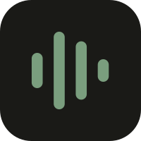
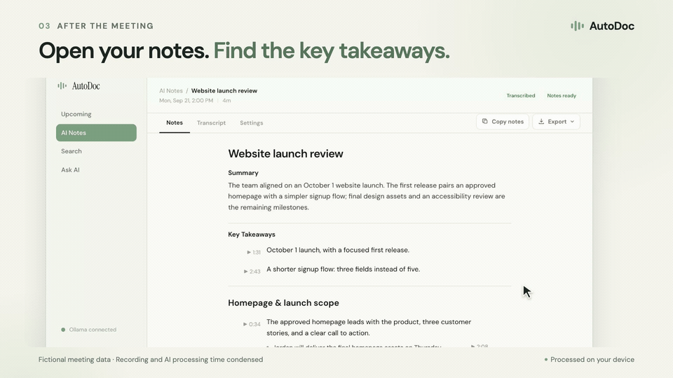
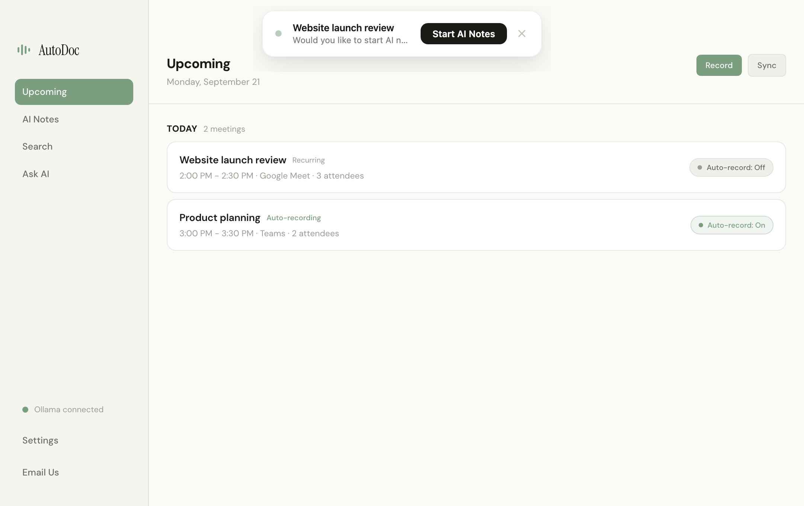
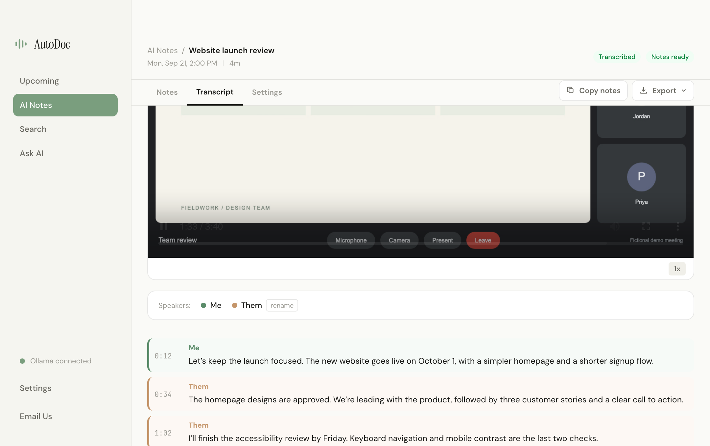
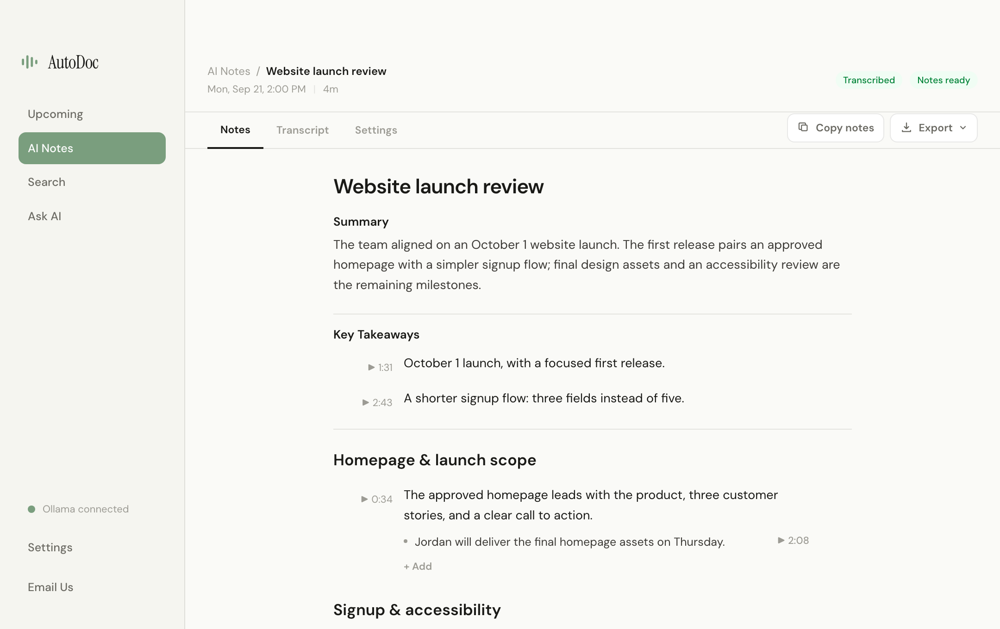
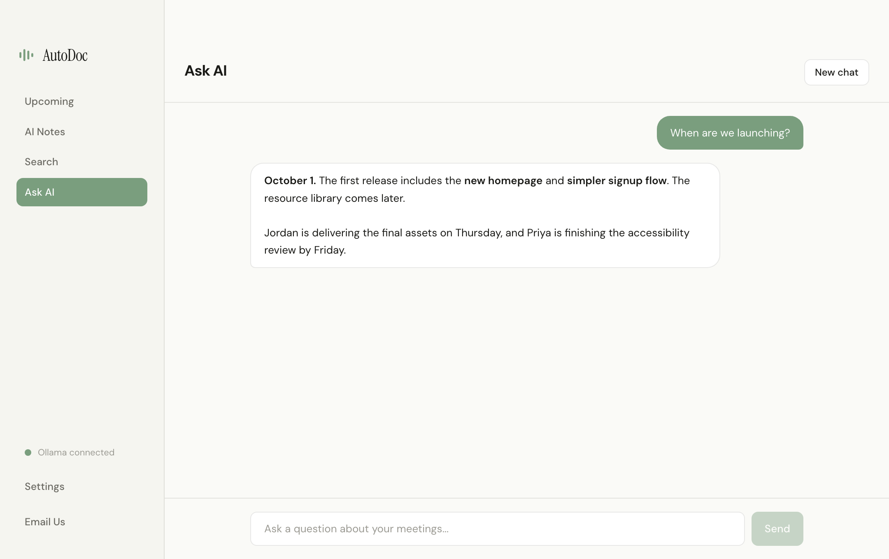
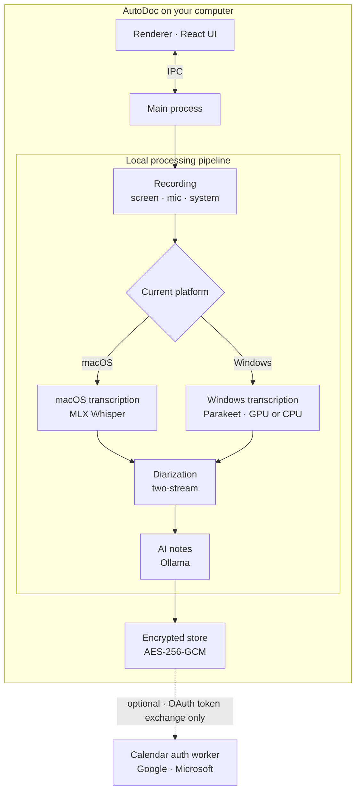

<div align="center">



# AutoDoc

### AI meeting notes that never leave your computer.

AutoDoc lives in your macOS menu bar or Windows system tray, notices when a meeting starts, and hands you a clean transcript and structured notes when it ends. Everything — recording, transcription, speaker labels, and AI summaries — happens on your own machine. No AutoDoc account. No AI API keys necessary.

[](https://github.com/DuetDisplay/AutoDoc/releases/download/v1.1.0/autodoc-1.1.0.dmg) [](https://github.com/DuetDisplay/AutoDoc/releases/download/v1.1.0/autodoc-1.1.0-setup.exe)

[](LICENSE) [](PRIVACY.md) [](#install) [](https://github.com/DuetDisplay/AutoDoc/releases/latest)

</div>

---

<div align="center">



</div>

---

## Table of Contents

- [Why AutoDoc](#why-autodoc)
- [How AutoDoc compares](#how-autodoc-compares)
- [Features](#features)
- [Features in action](#features-in-action)
- [Install](#install)
  - [System requirements (macOS)](#system-requirements-macos)
  - [System requirements (Windows)](#system-requirements-windows)
- [Build from source](#build-from-source)
- [Architecture](#architecture)
- [Privacy](#privacy)
- [FAQ](#faq)
- [Contributing](#contributing)
- [License](#license)
- [Acknowledgements](#acknowledgements)

## Why AutoDoc

Meeting AI tools are everywhere — but most of them ship your conversations to someone else's servers. AutoDoc takes the opposite stance: **every recording, transcript, and summary stays on your computer.**

- **Truly local.** Transcription runs on-device with [NVIDIA NeMo Parakeet](https://huggingface.co/nvidia/parakeet-tdt-0.6b-v3) on Windows and Apple [MLX](https://github.com/ml-explore/mlx) Whisper on Apple Silicon. Summaries run through a local [Ollama](https://ollama.com) instance AutoDoc manages on both platforms. No API keys, inference bills, or network round-trips for your audio.
- **Everything included.** Speaker diarization, Google **and** Microsoft calendar integration, automatic meeting detection, per-event auto-record, and chat-with-your-meetings are all part of the app — not a paid upgrade.
- **Encrypted at rest.** Recordings and transcripts use AES-256-GCM. When Electron `safeStorage` is available, the encryption key is protected by macOS Keychain or Windows DPAPI; otherwise, it is stored locally without operating-system protection.
- **Desktop-native.** Lives in your macOS menu bar or Windows system tray, detects meetings as they start, and gets out of your way.

## How AutoDoc compares

AutoDoc is built around a simple idea: the privacy-protecting choice shouldn't also be the feature-poor or expensive one.

| | **AutoDoc** | Cloud meeting AI | Other local/open-source assistants |
|---|:---:|:---:|:---:|
| Processing location | On your computer | Vendor servers | On-device |
| Audio & transcripts leave your device | **Never** | Yes | Never |
| Speaker diarization | ✅ Included | Varies | Often paid / coming soon |
| Calendar + per-event auto-record | ✅ Google + Microsoft | ✅ | Often paid / coming soon |
| Automatic meeting detection | ✅ Included | Varies | Often paid |
| Chat with your meetings | ✅ Included | Often paid | Often paid / coming soon |
| Encryption at rest | ✅ AES-256-GCM | Vendor-controlled | Rarely |
| Features above locked behind a paywall | ❌ Never | Usually | Sometimes |
| Cost | **Free & open source** | Subscription | Varies |

## Features

- **🎙️ Multi-track capture** — records screen, your microphone, and system audio as separate streams for clean diarization.
- **📝 On-device transcription** — Parakeet TDT 0.6B v3 on Windows; MLX Whisper with `distil-large-v3` on Apple Silicon.
- **🗣️ Speaker identification** — two-stream diarization labels who said what, with calendar-aware name suggestions.
- **🧠 AI meeting notes** — structured Decisions, Action Items, Information, Discussion, and Status Updates extracted locally with Ollama.
- **💬 Ask AI** — ask questions across your meetings and get grounded answers, entirely on-device.
- **📅 Calendar integration** — Google and Microsoft calendars, with Off / Once / Series auto-record per event.
- **🔔 Automatic meeting detection** — notices when a meeting starts (Zoom, Meet, Teams, Webex, Slack) and offers to record.
- **🔎 Full-text search** — search every transcript and note, with deep links straight to the moment.
- **🔒 Encryption at rest** — AES-256-GCM for recordings, transcripts, notes, and metadata. Electron `safeStorage` protects the key through the operating system when available; otherwise, the key is stored locally without operating-system protection.

See [`PRODUCT.md`](PRODUCT.md) for a deep technical breakdown of every subsystem.

## Features in action

| Automatic meeting detection | Speaker-colored transcript |
|---|---|
|  |  |

| AI notes by category | Ask AI across meetings |
|---|---|
|  |  |

## Install

> **Platform support:** AutoDoc supports **macOS 14+ on Apple Silicon** and **Windows 10+ on x64 PCs**. Intel Macs and Windows on ARM are not currently supported.

### System requirements (macOS)

Local-first meeting apps need real hardware headroom for on-device transcription and summarization. AutoDoc adjusts its processing profile to the available hardware while keeping meeting content on your device.

| | Requirement |
|---|---|
| **macOS** | 14.0 (Sonoma) or later |
| **Chip** | **Apple Silicon required** (M1, M2, M3, M4, or later). Intel Macs are not supported. |
| **Memory** | **8 GB minimum** · **16 GB recommended** for the default concurrent processing profile |
| **Storage** | **~10 GB free** for first-run downloads (Whisper + local Ollama model + MLX runtime cache), plus additional space for your encrypted recordings |
| **Network** | Required once during onboarding to download local AI models; not needed for day-to-day recording after setup |
| **Permissions** | **Screen Recording**, **Microphone**, and **System Audio Capture** (for remote participant audio) |

**What to expect on an 8 GB Mac:** AutoDoc detects limited memory and switches to a lower-impact profile automatically — smaller notes model (`llama3.2:3b`), serialized audio processing, and longer transcription/notes times. Everything still runs locally; a 16 GB machine is simply more comfortable for hour-long meetings with concurrent processing.

Transcription is built on [MLX](https://github.com/ml-explore/mlx) and requires Apple Silicon — there is no Intel or Rosetta fallback.

### System requirements (Windows)

| | Requirement |
|---|---|
| **Windows** | Windows 10 or later, 64-bit |
| **Processor** | x64 Intel or AMD processor |
| **Memory** | **8 GB minimum** · **16 GB recommended** |
| **GPU** | Optional. A compatible DirectML GPU with **4 GB+ VRAM** enables accelerated Parakeet transcription; AutoDoc falls back to CPU automatically. |
| **Storage** | **~10 GB free recommended** for first-run downloads and encrypted recordings |
| **Network** | Required once during onboarding to download local AI models; not needed for day-to-day recording after setup |
| **Permissions** | **Screen capture**, **Microphone**, and **System Audio** |

On lower-spec Windows PCs, AutoDoc uses a CPU-optimized Parakeet model and processes audio sources sequentially. This reduces memory pressure but can take longer after a meeting ends.

### Download & install on macOS

<div align="center">

## [⬇️ Download AutoDoc for macOS](https://github.com/DuetDisplay/AutoDoc/releases/download/v1.1.0/autodoc-1.1.0.dmg)

**Apple Silicon · macOS 14+**

</div>

Then:

1. **Download for macOS** `autodoc-1.1.0.dmg`, or browse the [Releases](https://github.com/DuetDisplay/AutoDoc/releases/latest) page for a specific version.
2. **Open** the `.dmg` and drag **AutoDoc** into your **Applications** folder.
3. **Launch** AutoDoc from Applications. On first run it walks you through granting **Screen Recording** and **Microphone** permissions; macOS verifies **System Audio Capture** separately when recording starts. AutoDoc then downloads its local transcription and AI models (~10 GB, one time).

That's it — no account, no API keys, nothing to configure. Everything runs locally from here on.

### Download & install on Windows

<div align="center">

## [⬇️ Download AutoDoc for Windows](https://github.com/DuetDisplay/AutoDoc/releases/download/v1.1.0/autodoc-1.1.0-setup.exe)

**64-bit · Windows 10+**

</div>

Then:

1. **Download for Windows** `autodoc-1.1.0-setup.exe`, or browse the [Releases](https://github.com/DuetDisplay/AutoDoc/releases/latest) page for a specific version.
2. **Open** the installer and follow the setup prompts.
3. **Launch** AutoDoc. On first run it walks you through capture permissions and downloads the local Parakeet and Ollama models.

## Build from source

AutoDoc is an Electron + electron-vite app. To build it yourself:

**Prerequisites**

- **macOS:** Apple Silicon Mac (M1 or later) running macOS 14+, plus Xcode command-line tools and [Homebrew](https://brew.sh)
- **Windows:** Windows 10+ on x64, plus the prerequisites documented by the setup scripts
- Node.js 20+

**Steps**

```bash
git clone https://github.com/DuetDisplay/AutoDoc.git
cd AutoDoc
npm ci
cp .env.example .env   # optional: configure self-hosting knobs
npm run build:mac      # macOS: produces a DMG under dist/
# or
npm run build:win      # Windows: produces an installer under dist/
```

To run in development:

```bash
npm run dev
```

If you want calendar integration or your own hosted services in a fork build, see [`docs/SELF_HOSTING.md`](docs/SELF_HOSTING.md) for the required environment variables and OAuth setup. Forks do **not** use Duet's hosted infrastructure by default.

## Architecture

AutoDoc is a single Electron desktop app. The **main process** owns recording, the transcription/diarization/summarization pipeline, encryption, calendar sync, and the local Ollama lifecycle. The **renderer** is a React UI. All heavy processing happens locally.


```mermaid
flowchart TB
  subgraph app["AutoDoc on your computer"]
    UI["Renderer · React UI"] <-->|IPC| Main["Main process"]

    subgraph pipeline["Local processing pipeline"]
      direction LR
      Rec["Recording<br/>screen · mic · system"]
      Platform{"Current platform"}
      MacTrans["macOS transcription<br/>MLX Whisper"]
      WinTrans["Windows transcription<br/>Parakeet · GPU or CPU"]
      Diar["Diarization<br/>two-stream"]
      Notes["AI notes<br/>Ollama"]
    end

    Main --> Rec
    Rec --> Platform
    Platform -->|macOS| MacTrans
    Platform -->|Windows| WinTrans
    MacTrans --> Diar
    WinTrans --> Diar
    Diar --> Notes
    Notes --> Store["Encrypted store<br/>AES-256-GCM"]
  end

  Store -.->|"optional · OAuth token exchange only"| Auth["Calendar auth worker<br/>Google · Microsoft"]
```

The only optional network component is a stateless Cloudflare Worker used purely for OAuth token exchange during calendar sign-in — it never sees your audio, transcripts, or notes. Full details in [`PRODUCT.md`](PRODUCT.md).

## Privacy

AutoDoc processes everything on-device. Audio, transcripts, and notes never leave your computer. Analytics and crash reporting are strictly **opt-in**; before opt-in, analytics facts stay local only. Read the full [**Privacy Policy**](PRIVACY.md) for exactly what is and isn't collected.

## FAQ

**Does anything leave my computer?**
No. Recording, transcription, diarization, and summarization all run locally. The only optional network call is OAuth token exchange when you connect a calendar — and even that never touches your meeting content.

**Do I need an OpenAI or Anthropic API key?**
No. AutoDoc runs summaries on a local Ollama instance it manages for you. There are no API keys and no per-meeting costs.

**Which models does it use?**
On Windows, AutoDoc uses Parakeet TDT 0.6B v3 and automatically selects DirectML GPU acceleration or a CPU-optimized model. On Apple Silicon, it uses `distil-large-v3` through MLX Whisper. Notes use `llama3.1` via Ollama on both platforms, with a smaller `llama3.2:3b` model on 8 GB Macs.

**What Mac do I need?**
An **Apple Silicon Mac** (M1 or later) running macOS 14+, with 8 GB RAM minimum (16 GB recommended) and ~10 GB free storage for first-run model downloads. **Intel Macs are not supported.**

**Is Windows supported?**
Yes. AutoDoc supports 64-bit Windows 10 and later. It requires 8 GB RAM; 16 GB is recommended. A compatible DirectML GPU is optional because AutoDoc can transcribe on the CPU.

**Why AGPL-3.0?**
See [License](#license) below.

## Contributing

Contributions are welcome! Please read [`CONTRIBUTING.md`](CONTRIBUTING.md) and our [`CODE_OF_CONDUCT.md`](CODE_OF_CONDUCT.md) before opening a pull request. Security issues should follow the process in [`SECURITY.md`](SECURITY.md).

## License

AutoDoc is licensed under the **GNU Affero General Public License v3.0** ([`LICENSE`](LICENSE)).

In plain English: you're free to use, study, modify, and share AutoDoc. The AGPL adds one important condition — if you run a modified version as a network service, you must make your source available to its users under the same license. We chose AGPL deliberately: it keeps AutoDoc and its derivatives open, and it prevents anyone from turning the project into a closed, hosted product on top of our work. For most individuals and teams using or self-hosting AutoDoc, this changes nothing.

## Acknowledgements

AutoDoc stands on the shoulders of excellent open-source work:

- [whisper.cpp](https://github.com/ggerganov/whisper.cpp) — on-device speech-to-text
- [NVIDIA NeMo Parakeet](https://huggingface.co/nvidia/parakeet-tdt-0.6b-v3) — Windows speech-to-text
- [ONNX Runtime](https://onnxruntime.ai/) and [DirectML](https://github.com/microsoft/DirectML) — Windows inference
- [faster-whisper](https://github.com/SYSTRAN/faster-whisper) and [CTranslate2](https://github.com/OpenNMT/CTranslate2) — compatibility transcription
- [Ollama](https://ollama.com) — local LLM runtime
- [Apple MLX](https://github.com/ml-explore/mlx) — Apple Silicon acceleration
- [FFmpeg](https://ffmpeg.org) — audio/video processing
- [Electron](https://www.electronjs.org) + [electron-vite](https://electron-vite.org) — desktop app foundation

---

<div align="center">
Made by <a href="https://getautodoc.com/">Duet Display, Inc.</a>
</div>
