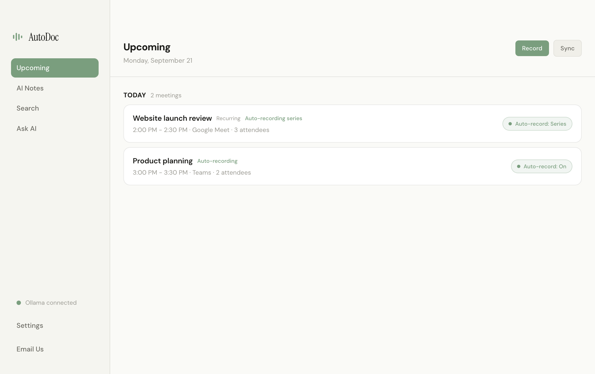
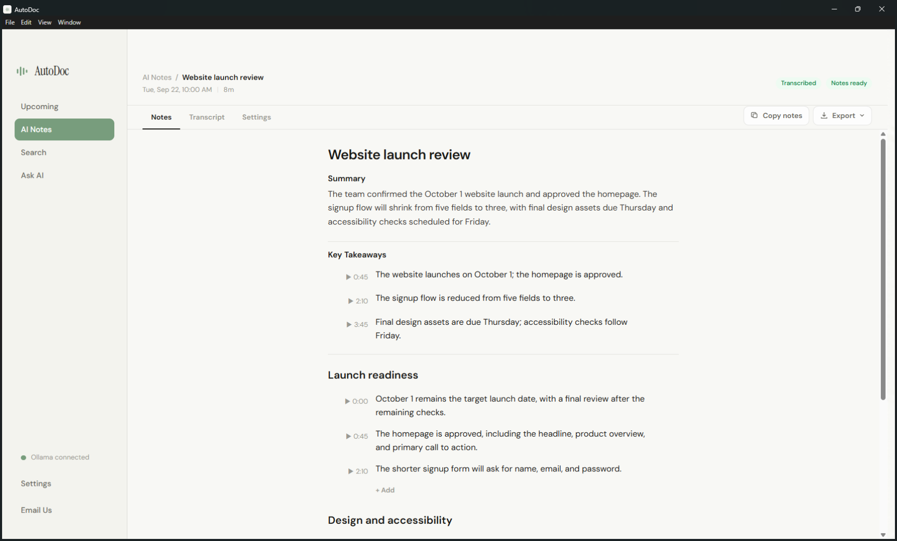
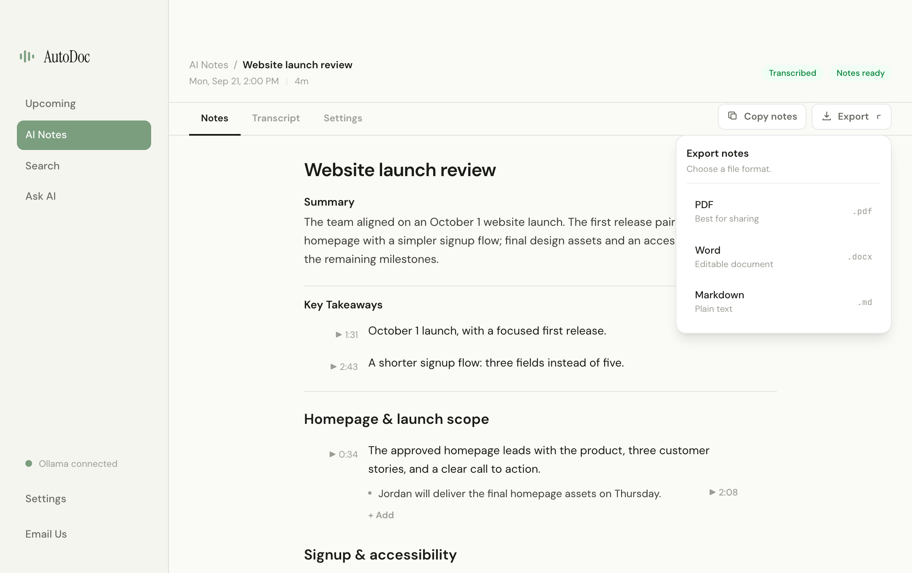
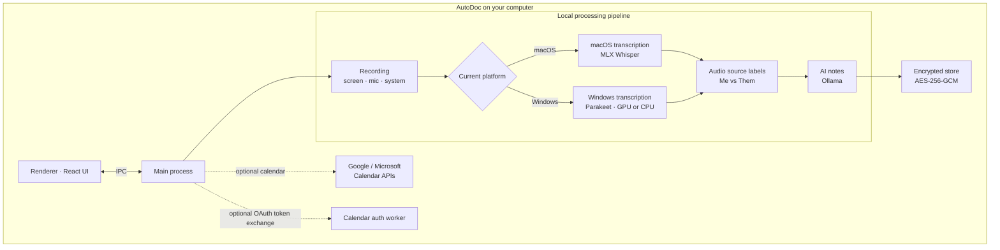

<div align="center">


# AutoDoc

### Open-source meeting notes, processed on your computer.

AutoDoc is an open-source, local-first meeting notes app for macOS and Windows. Record your screen and meeting audio, get editable notes, and click a note's timestamp to replay the moment. Transcription, notes, and Ask AI run on your computer. No AutoDoc account or AI API key required.

[**⬇️ Jump to downloads**](#download)

Ready-to-use installers are available for Mac and Windows. You do not need to build from source.

[](https://github.com/DuetDisplay/AutoDoc/releases/latest) [](https://github.com/DuetDisplay/AutoDoc/releases/latest)

[](LICENSE) [](PRIVACY.md) [](#download) [](https://github.com/DuetDisplay/AutoDoc/releases/latest)

</div>

---

<div align="center">


Notes and timestamp playback (short excerpt). [Watch the full 34-second product demo](docs/assets/demo-v1.2/autodoc-demo.mp4).

**New in v1.2.0:** topic-based notes, timestamped playback, PDF/Word/Markdown export, and reliability fixes. [Read the release notes](https://github.com/DuetDisplay/AutoDoc/releases/tag/v1.2.0).

</div>

---

## Table of Contents

- [Why AutoDoc](#why-autodoc)
- [What you get](#what-you-get)
- [Features](#features)
- [Features in action](#features-in-action)
- [Download](#download)
  - [System requirements (macOS)](#system-requirements-macos)
  - [System requirements (Windows)](#system-requirements-windows)
- [Build from source](#build-from-source)
- [Architecture](#architecture)
- [Privacy](#privacy)
- [FAQ](#faq)
- [Contributing](#contributing)
- [License](#license)
- [Acknowledgements](#acknowledgements)

## Why AutoDoc

AutoDoc is for people who want AI meeting notes without sending meeting content to a cloud AI service. Transcription, notes, and Ask AI run locally, and the screen recording stays available when you need to revisit what was shown.

Looking for a Granola alternative with local processing and replayable recordings? See [how AutoDoc compares](https://getautodoc.com/granola-alternative).

- **Truly local.** Transcription runs on-device with [NVIDIA NeMo Parakeet](https://huggingface.co/nvidia/parakeet-tdt-0.6b-v3) on Windows and Apple [MLX](https://github.com/ml-explore/mlx) Whisper on Apple Silicon. Summaries run through a local [Ollama](https://ollama.com) instance AutoDoc manages on both platforms. No API keys, inference bills, or network round-trips for your audio.
- **Everything included.** Video playback with timestamp links, Google **and** Microsoft calendar integration, automatic meeting detection, per-event auto-record, and chat-with-your-meetings are all part of the app — not a paid upgrade.
- **Encrypted at rest.** Recordings and transcripts use AES-256-GCM. When Electron `safeStorage` is available, the encryption key is protected by macOS Keychain or Windows DPAPI; otherwise, it is stored locally without operating-system protection.
- **Desktop-native.** Lives in your macOS menu bar or Windows system tray, detects meetings as they start, and gets out of your way.

## What you get

- End-to-end local workflow: detect → record → transcribe → notes → replay key moments → Ask AI
- Platform-specific transcription: MLX Whisper on Apple Silicon, Parakeet on Windows
- Optional Google and Microsoft calendars
- Encrypted local storage, AGPL-3.0 source, no AutoDoc account or AI API keys

## Features

- **🎙️ Multi-track capture** — records screen, your microphone, and system audio as separate streams.
- **📝 On-device transcription** — Parakeet TDT 0.6B v3 on Windows; MLX Whisper with `distil-large-v3` on Apple Silicon.
- **▶️ Replay key moments** — view the recording in the Transcript tab, or click an available note timestamp to jump to that moment in the video.
- **Audio source labels** — microphone audio is labeled Me and combined system audio is labeled Them. AutoDoc does not identify individual remote participants.
- **Editable meeting notes** — get a summary and conversation topics with supporting details. Edit notes and click available timestamps to replay the corresponding moment in the recording.
- **Copy and export** — copy notes as plain text or export them as PDF, Word, or Markdown.
- **💬 Ask AI** — ask questions across your meetings and get grounded answers, entirely on-device.
- **📅 Calendar integration** — Google and Microsoft calendars, with Off / Once / Series auto-record per event.
- **🔔 Automatic meeting detection** — notices when a meeting starts (Zoom, Meet, Teams, Webex, Slack) and offers to record.
- **🔎 Full-text search** — search every transcript and note, with deep links straight to the moment.
- **🔒 Encryption at rest** — AES-256-GCM for recordings, transcripts, notes, and metadata. Electron `safeStorage` protects the key through the operating system when available; otherwise, the key is stored locally without operating-system protection.

See [`PRODUCT.md`](PRODUCT.md) for a deep technical breakdown of every subsystem.

## Features in action

| Calendar auto-recording | Video and timestamped transcript |
|---|---|
|  |  |

| Notes with a summary, topics, and details | Ask AI across meetings |
|---|---|
|  |  |

<details>
<summary>AutoDoc Notes on Windows</summary>

[](docs/assets/screenshots/windows-notes-v1.2.png)

</details>

<details>
<summary>Copy and export</summary>

[](docs/assets/screenshots/export-menu-v1.2.png)

</details>

## Download

Official macOS and Windows installers are published on GitHub Releases. Open the latest release and choose the asset for your platform:

<div align="center">

## [⬇️ View the latest AutoDoc release](https://github.com/DuetDisplay/AutoDoc/releases/latest)

</div>

> **Platform support:** AutoDoc supports **macOS 14+ on Apple Silicon** and **Windows 10+ on x64 PCs**. Intel Macs and Windows on ARM are not currently supported.

### System requirements (macOS)

Local-first meeting apps need real hardware headroom for on-device transcription and summarization. AutoDoc adjusts its processing profile to the available hardware while keeping meeting content on your device.

| | Requirement |
|---|---|
| **macOS** | 14.0 (Sonoma) or later |
| **Chip** | **Apple Silicon required** (M1, M2, M3, M4, or later). Intel Macs are not supported. |
| **Memory** | **8 GB minimum** (supported) · **16 GB+ recommended** for the best experience |
| **Storage** | **~10 GB free** for first-run downloads (Whisper + local Ollama model + MLX runtime cache), plus additional space for your encrypted recordings |
| **Network** | Required for the first-run model download. After setup, recording, transcription, and notes work offline. Optional network use later: app/model updates, calendar sync, and opt-in diagnostics. |
| **Permissions** | **Screen Recording**, **Microphone**, and **System Audio Capture** (for remote participant audio) |

**What to expect on 8 GB:** AutoDoc still runs, but it switches to a lower-impact profile — smaller notes model (`llama3.2:3b`), sequential audio processing, and notes after transcription. Expect a longer wait after the meeting. **16 GB+ is recommended for the best experience.**

Transcription is built on [MLX](https://github.com/ml-explore/mlx) and requires Apple Silicon — there is no Intel or Rosetta fallback.

### System requirements (Windows)

| | Requirement |
|---|---|
| **Windows** | Windows 10 or later, 64-bit |
| **Processor** | x64 Intel or AMD processor; **8+ logical processors** recommended for CPU-only processing |
| **Memory** | **8 GB minimum** (supported) · **16 GB+ recommended** for the best experience |
| **GPU** | Optional. A compatible DirectML GPU with **4 GB+ VRAM** enables accelerated Parakeet transcription; AutoDoc falls back to CPU automatically. |
| **Storage** | **~10 GB free** for first-run model downloads, plus additional space for encrypted recordings |
| **Network** | Required for the first-run model download. After setup, recording, transcription, and notes work offline. Optional network use later: app/model updates, calendar sync, and opt-in diagnostics. |
| **Permissions** | **Screen capture**, **Microphone**, and **System Audio** |

**What to expect on 8 GB:** AutoDoc still runs, but it uses the smaller notes model (`llama3.2:3b`) and a lower-impact path. Audio sources may be processed sequentially and notes wait until transcription finishes, so expect a longer post-meeting wait. **16 GB+ is recommended for the best experience.** A compatible DirectML GPU can accelerate transcription, but it does not replace the RAM headroom.

On lower-spec Windows PCs, AutoDoc uses a CPU-optimized Parakeet model and processes audio sources sequentially. CPU-only machines with fewer than 8 logical processors, or under 16 GB of RAM, also use `llama3.2:3b` even when they have more than 8 GB of memory. This reduces memory pressure but can take longer after a meeting ends.

### Download & install on macOS

<div align="center">

## [⬇️ Download AutoDoc for macOS](https://github.com/DuetDisplay/AutoDoc/releases/latest)

**Apple Silicon · macOS 14+**

</div>

Then:

1. On the [latest release](https://github.com/DuetDisplay/AutoDoc/releases/latest), download the macOS `.dmg` asset.
2. **Open** the `.dmg` and drag **AutoDoc** into your **Applications** folder.
3. **Launch** AutoDoc from Applications. On first run it walks you through granting **Screen Recording** and **Microphone** permissions; macOS verifies **System Audio Capture** separately when recording starts. AutoDoc then downloads its local transcription and AI models (~10 GB, one time).

That's it — no account, no API keys, nothing to configure. Meeting processing runs locally from here on.

### Download & install on Windows

<div align="center">

## [⬇️ Download AutoDoc for Windows](https://github.com/DuetDisplay/AutoDoc/releases/latest)

**64-bit · Windows 10+**

</div>

Then:

1. On the [latest release](https://github.com/DuetDisplay/AutoDoc/releases/latest), download the Windows `.exe` installer asset.
2. **Open** the installer and follow the setup prompts.
3. **Launch** AutoDoc. On first run it walks you through capture permissions and downloads the local Parakeet and Ollama models.

## Build from source

AutoDoc is an Electron + electron-vite app. To build it yourself:

**Prerequisites**

- **macOS:** Apple Silicon Mac (M1 or later) running macOS 14+, plus Xcode command-line tools and [Homebrew](https://brew.sh)
- **Windows:** Windows 10+ on x64, plus the prerequisites documented by the setup scripts
- Node.js 20+

**Steps**

```bash
git clone https://github.com/DuetDisplay/AutoDoc.git
cd AutoDoc
npm ci
cp .env.example .env   # optional: configure self-hosting knobs
npm run build:mac      # macOS: produces a DMG under dist/
# or
npm run build:win      # Windows: produces an installer under dist/
```

To run in development:

```bash
npm run dev
```

If you want calendar integration or your own hosted services in a fork build, see [`docs/SELF_HOSTING.md`](docs/SELF_HOSTING.md) for the required environment variables and OAuth setup. Forks do **not** use Duet's hosted infrastructure by default.

## Architecture

AutoDoc is a single Electron desktop app. The **main process** owns recording, the transcription / summarization pipeline, encryption, calendar sync, and the local Ollama lifecycle. The **renderer** is a React UI. All heavy processing happens locally.


```mermaid
flowchart TB
  subgraph app["AutoDoc on your computer"]
    UI["Renderer · React UI"] <-->|IPC| Main["Main process"]

    subgraph pipeline["Local processing pipeline"]
      direction LR
      Rec["Recording<br/>screen · mic · system"]
      Platform{"Current platform"}
      MacTrans["macOS transcription<br/>MLX Whisper"]
      WinTrans["Windows transcription<br/>Parakeet · GPU or CPU"]
      Labels["Audio source labels<br/>Me vs Them"]
      Notes["AI notes<br/>Ollama"]
    end

    Main --> Rec
    Rec --> Platform
    Platform -->|macOS| MacTrans
    Platform -->|Windows| WinTrans
    MacTrans --> Labels
    WinTrans --> Labels
    Labels --> Notes
    Notes --> Store["Encrypted store<br/>AES-256-GCM"]

    Main -.->|"optional calendar"| Cal["Google / Microsoft<br/>Calendar APIs"]
    Main -.->|"optional OAuth token exchange"| Auth["Calendar auth worker"]
  end
```

Meeting content stays in the local pipeline and encrypted store. Optional calendar networking is separate:

- Optional calendar sync communicates directly with Google or Microsoft APIs.
  Duet's stateless OAuth worker only exchanges tokens and never receives meeting
  recordings, transcripts, or notes.

Model downloads, app updates, and opt-in analytics or crash reporting also use the network when those paths are active. Full details in [`PRODUCT.md`](PRODUCT.md) and [`PRIVACY.md`](PRIVACY.md).

## Privacy

AutoDoc processes meeting content on-device. Audio, transcripts, and notes are not uploaded to AutoDoc or a cloud AI API. Analytics and crash reporting are strictly **opt-in**; before opt-in, analytics facts stay local only. Read the full [**Privacy Policy**](PRIVACY.md) for exactly what is and isn't collected.

## FAQ

**What do meeting notes look like?**
AutoDoc creates a summary and conversation topics with editable details. Available timestamps let you check the corresponding moment in the recording. Review generated notes before relying on them.

**Will my existing notes change after updating?**
Updating does not automatically regenerate your existing meeting notes. You can reprocess a meeting when you want to generate new notes. Older notes remain supported.

**Can I export my notes?**
Yes. Copy notes as plain text or export them as PDF, Word, or Markdown. Exported files are separate from AutoDoc's encrypted storage.

**What stays on my computer?**
Your recordings, transcripts, notes, and Ask AI processing stay on your computer. AutoDoc does not upload meeting content to a cloud AI service for transcription or note generation. Files you choose to export or share are under your control.

**When does AutoDoc use the network?**
- Required once for the first-run download of local transcription and Ollama models
- Optional later: app updates and additional model downloads
- Optional Google/Microsoft calendar sync — the app talks to Google or Microsoft APIs for events; Duet's OAuth worker only exchanges tokens and never receives meeting recordings, transcripts, or notes
- Optional analytics / crash reporting, only if you opt in

After setup, recording, transcription, and notes work offline.

**Do I need an OpenAI or Anthropic API key?**
No. AutoDoc runs summaries on a local Ollama instance it manages for you. There are no API keys and no per-meeting costs.

**Which models does it use?**
On Windows, AutoDoc uses Parakeet TDT 0.6B v3 and automatically selects DirectML GPU acceleration or a CPU-optimized model. On Apple Silicon, it uses `distil-large-v3` through MLX Whisper. Notes run on a local Ollama instance. The default notes model is `qwen3:4b-instruct`. Macs with 8 GB of RAM use `llama3.2:3b`. Windows PCs with 8 GB of RAM use it too, including ones with a GPU. Windows CPU machines with fewer than 8 logical processors, or under 16 GB of RAM, also use `llama3.2:3b`. Ask AI answers use that same notes model. Ask AI search uses `qwen3-embedding:0.6b`. After an app update on a machine that uses `qwen3:4b-instruct`, leftover `llama3.1` keeps working until the new notes model is on disk.

**What Mac do I need?**
An **Apple Silicon Mac** (M1 or later) running macOS 14+, with 8 GB RAM minimum (16 GB+ recommended for the best experience) and ~10 GB free storage for first-run model downloads. On 8 GB, AutoDoc uses a smaller notes model and slower processing. **Intel Macs are not supported.**

**Is Windows supported?**
Yes. AutoDoc supports 64-bit Windows 10 and later. 8 GB RAM is supported; **16 GB+ is recommended for the best experience.** On 8 GB systems, and on CPU systems with fewer than 8 logical processors or under 16 GB of RAM, AutoDoc uses a smaller notes model and lower-impact processing, so huddles take longer. A compatible DirectML GPU is optional because AutoDoc can transcribe on the CPU.

**How do I know AutoDoc is recording?**
While recording, AutoDoc shows a Recording banner in the app (with a timer and stop control) and switches the menu bar / tray icon to a recording state. Meeting detection only offers to start recording; it will not start silently unless you previously enabled calendar auto-record for that event (Once or Series). In that case, recording can begin without another prompt.

**What about other participants?**
AutoDoc records on your computer. It does not join the call as a bot or announce itself to others. You are responsible for following the recording laws and norms that apply to your meeting.

**Why AGPL-3.0?**
See [License](#license) below.

## Contributing

Contributions are welcome! Please read [`CONTRIBUTING.md`](CONTRIBUTING.md), the [`ROADMAP.md`](ROADMAP.md), and our [`CODE_OF_CONDUCT.md`](CODE_OF_CONDUCT.md) before opening a pull request. Security issues should follow the process in [`SECURITY.md`](SECURITY.md).

Find AutoDoc useful? Star the repo to bookmark it, or watch releases for updates. Want to help? See the roadmap and contribution guide.

## License

AutoDoc is licensed under the **GNU Affero General Public License v3.0** ([`LICENSE`](LICENSE)).

In plain English: you're free to use, study, modify, and share AutoDoc. The AGPL adds one important condition — if you run a modified version as a network service, you must make your source available to its users under the same license. We chose AGPL deliberately: it keeps AutoDoc and its derivatives open, and it prevents anyone from turning the project into a closed, hosted product on top of our work. For most individuals and teams using or self-hosting AutoDoc, this changes nothing.

## Acknowledgements

AutoDoc stands on the shoulders of excellent open-source work:

- [whisper.cpp](https://github.com/ggerganov/whisper.cpp) — on-device speech-to-text
- [NVIDIA NeMo Parakeet](https://huggingface.co/nvidia/parakeet-tdt-0.6b-v3) — Windows speech-to-text
- [ONNX Runtime](https://onnxruntime.ai/) and [DirectML](https://github.com/microsoft/DirectML) — Windows inference
- [faster-whisper](https://github.com/SYSTRAN/faster-whisper) and [CTranslate2](https://github.com/OpenNMT/CTranslate2) — compatibility transcription
- [Ollama](https://ollama.com) — local LLM runtime
- [Apple MLX](https://github.com/ml-explore/mlx) — Apple Silicon acceleration
- [FFmpeg](https://ffmpeg.org) — audio/video processing
- [Electron](https://www.electronjs.org) + [electron-vite](https://electron-vite.org) — desktop app foundation

---

<div align="center">
Made by <a href="https://getautodoc.com/">Duet Display, Inc.</a>
</div>
